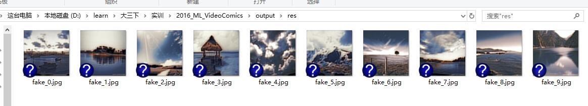

# VideoComics

[Github](https://github.com/liuxiyin/project-training-2015)
[项目的具体原理]()

### 项目介绍：
在这高速发展的时期中，各种技术在不断进步，许多新功能也在不断浮现。《VideoComics》也是其中之一，可以带给用户多种享受。 
本项目是基于对抗神经网络(gan)完成的风格转换。本项目是把所选中的视频中关键帧提取出来，并且将关键帧图像转换成不同风格的图像。

### 项目组成员：
我们的项目组由三个人构成，项目构建的过程主要涉及：编程环境的搭建，神经网络的构成，神经网络的训练过程，web界面的展示，这几个步骤。 其中：

* 刘佳昌（主要负责神经网络的构建建以及神经网络的构成）
  * github: https://github.com/liujiachang
  * 电子邮箱：1040496263@qq.com

* 徐润凯 （主要负责web界面的展示）
  * github: https://github.com/xurunkai
  * 电子邮箱：996874863@qq.com

* 刘西寅（主要负责编程环境的搭建和神经网络的训练过程）
  * github: https://github.com/liuxiyin
  * 电子邮箱：915709379@qq.com

### 效果展示

| train_B |  |
|:-----:|:--------:|
